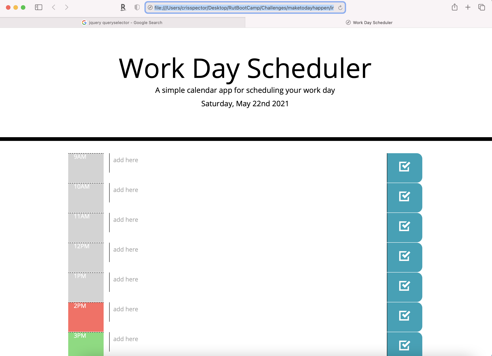

# maketodayhappen

## Summary
* Create a simple calendar application that allows a user to save events for each hour of the day. This app will run in the browser and feature dynamically updated HTML and CSS powered by jQuery.

### To Execute File:
Open in browser
This site was built using [GitHub Pages](https://spectocr.github.io/maketodayhappen/)

### Features: 
HTML, Javascript, CSS

## Authors

**Cris Spector**

